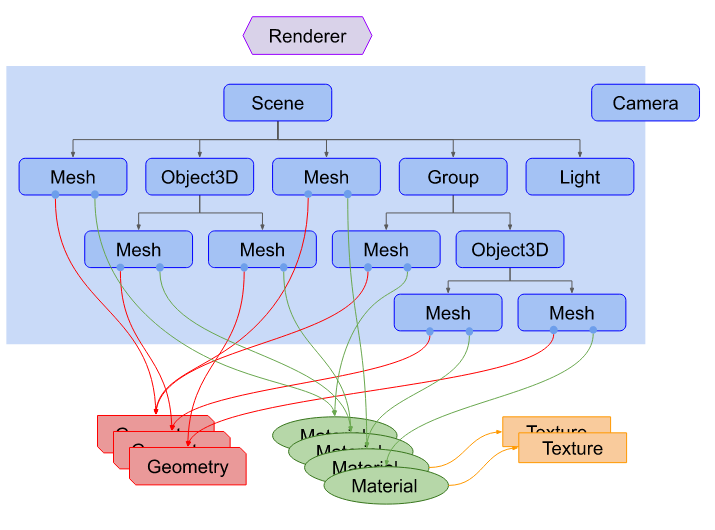
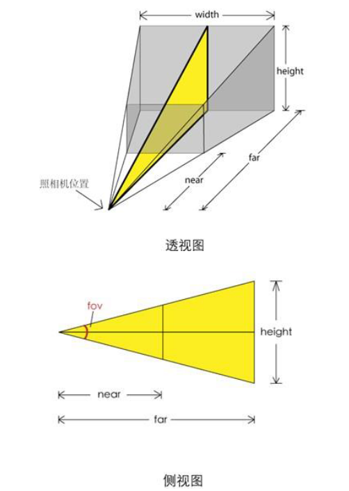
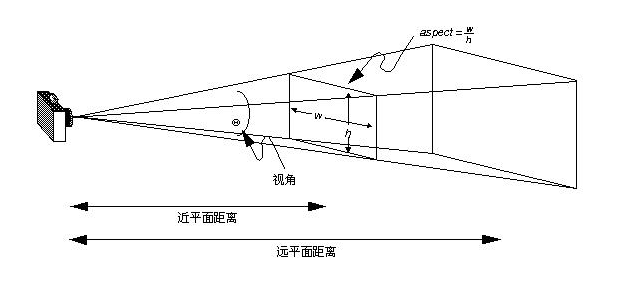
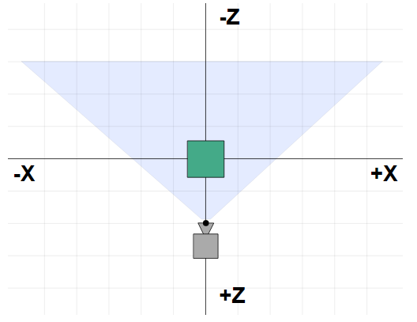

# Three.js Fundamentals

## Overview

[toc]

### 1. Structure of a three.js app



#### renderer

Pass a `Sence` and a `Camera` to `rendere`, it renders the portion of the 3D sence that is inside the **frustum（锥体） of the camera（相机的视锥体）** as a 2D image to a canvas。

#### Mesh

Mesh用来表示一个对象，包含属性位置（position）和方向（orientation）。Mesh可以指定的`Geometry（几何，表示顶点信息）`和`Material（表示颜色信息）`。**多个Mesh可以引用同一个Geometry或Material**

#### Light

光源。

#### Geometry

一个几何体的顶点(Vertex)信息。

#### Material

表示画Mesh对应的几何体时的“表面”属性，包含了“颜色”和“how shiny（闪亮） it is”。`Material`可以指定一个或者多个`Texture`对象。最终，Material表示的各种表面属性都会被计算成为像素的RGB。


## 基础API

### 1. create WebGLRender

`WebGLRender`可以在`canvas`元素上渲染3d图形。可以有如下两种方式创建renderer：

- 创建时，传入canvas

```js
const canvas = document.querySelector('#c');// 如果canvas没有设置宽高，默认为300x150
const renderer = new THREE.WebGLRenderer({canvas});
```

- 创建时，不传入canvas，renderer会自动创建一个canvas元素，需要将这个元素加入到DOM tree

```js
const renderer = new THREE.WebGLRenderer();
renderer.setSize( window.innerWidth, window.innerHeight );
document.body.appendChild( renderer.domElement );
```

### 2. create Camera

```js
const fov = 75;
const aspect = 2;  // the canvas default
const near = 0.1;
const far = 5;
const camera = new THREE.PerspectiveCamera(fov, aspect, near, far);
```





`PerspectiveCamera`的四个参数就是用来定义一个上图所示的视锥体：

- fov表示可见区域竖直方向的夹角
- aspect表示宽高比，即上图的width/height

- near表示可见区域近端的平面与相机的距离
- far表示可见区域远端的平面与相机的距离


相机默认的方向是看向Z轴的负方向，默认的坐标为(0, 0, 0)，想实现下图的效果，需要移动相机的位置：

```js
camera.position.z = 2;
```





### 3. create Scene

Scene是一个“场景图（实际上结构是一颗树）”的根。因此，想要画出来的东西都需要添加到sence中。

```js
const scene = new THREE.Scene();
```


### 4. Geometry

构建一个几何体的顶点数据。

```js
const boxWidth = 1;
const boxHeight = 1;
const boxDepth = 1;
const geometry = new THREE.BoxGeometry(boxWidth, boxHeight, boxDepth);
```

### 5. Materia

构建一个几何体的“表面”（颜色、材质等）数据。

```js
const material = new THREE.MeshBasicMaterial({color: 0x44aa88});
```

### 6. 创建Mesh

创建Mesh时，需要下面三个组成部分：

- Geometry（对象的形状、即顶点数据）
- Material（表面画成什么样，即表面属性）
- Position、orientation、scale，与父对象相关。

```js
const cube = new THREE.Mesh(geometry, material);
```

### 7. 将Mesh对象添加到sence

```js
scene.add(cube);
```

### 8. renderer渲染

renderer就是将camera"观察"sence的结果渲染出来，所以需要传入sence和camera

```js
renderer.render(scene, camera);
```

## 动画

```js
function animation(time) {
    
    time *= 0.01; // convert milliseconds to seconds
    cube.rotation.x = time;
    cube.rotation.y = time;
    
    renderer.render(scene, camera);
    requestAnimationFrame(animation);
}

requestAnimationFrame(animation);
```

### requestAnimationFrame(callback)

- Parameter : callback

callback在再一次渲染时被调用，调用callback时，会传递一个类型为`DomHighResTimeStamp`的参数。

## 添加光源

### create directional（定向的） light

```js
{
  const color = 0xFFFFFF;
  const intensity = 1; // 强度
  const light = new THREE.DirectionalLight(color, intensity);
  light.position.set(-1, 2, 4);
  scene.add(light);
}
```

光源有位置和目标（方向），默认情况下，这两个位置都是(0, 0, 0)，上面的例子中，将光源的位置修改为(-1, 2, 4)。


### 使用可以被光源影响的material : PhongMaterial

```js
const material = new THREE.MeshPhongMaterial({ color : 0x44aa88 });
```


